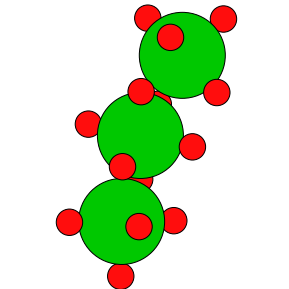

# PyhCha

Atomic Polyhedra Chains

The scripts and code to build atomic polyhedra chains and calculate pair radial distribution functions (PDF, RDF, etc) for them.

- Atomic Simulation Environment (ASE) <https://wiki.fysik.dtu.dk/ase/> is inheritely used. 

	A.H. Larsen, J.J. Mortensen, J. Blomqvist, I.E. Castelli, R. Christensen, M. Dułak, J. Friis, M.N. Groves, B. Hammer, C. Hargus, E.D. Hermes, P.C. Jennings, P.B. Jensen, J. Kermode, J.R. Kitchin, E.L. Kolsbjerg, J. Kubal, K. Kaasbjerg, S. Lysgaard, J.B. Maronsson, T. Maxson, T. Olsen, L. Pastewka, A. Peterson, C. Rostgaard, J. Schiøtz, O. Schütt, M. Strange, K.S. Thygesen, T. Vegge, L. Vilhelmsen, M. Walter, Z. Zeng, K.W. Jacobsen
	The atomic simulation environment - a Python library for working with atoms
	J. Phys.: Condens. Matter, 2017, 29, 273002 

- Polyhedra data are from:

    Arrangement of n points on a sphere in 3 dimensions
    so as to maximize the volume of the convex hull
    [1994 by R. H. Hardin, N. J. A. Sloane & W. D. Smith]
    <http://neilsloane.com/maxvolumes>


- PDF calculation code is adapted from C++ code of PDFgui <https://github.com/diffpy/diffpy.pdfgui.git>

    C. L. Farrow, P. Juhas, J. W. Liu, D. Bryndin, E. S. Bozin,
    J. Bloch, Th. Proffen and S. J. L. Billinge, PDFfit2 and
    PDFgui: computer programs for studying nanostructure in
    crystals, J. Phys.: Condens.  Matter 19, 335219 (2007)
    
    
    
## Example

```python
from gen_AOn_chain import gen_polyhedra_chain

atoms = gen_polyhedra_chain(n_verteces=6, R=2.75, phi1=30, theta=120, phi2=30, A='Ba')

print(atoms)
```

Output:

Atoms(symbols='BaO6BaO5BaO5', pbc=False)




## Acknowledgments

The work was financially supported by a Russian Science Foundation,
grant # 22-12-00106.

